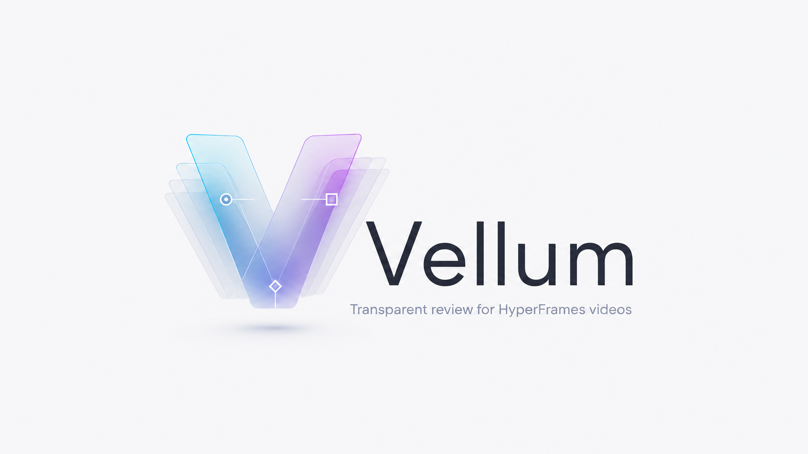

<div align="center">



### You see the problem. Your agent can't.

**Vellum is the transparent review layer for [HyperFrames](https://hyperframes.heygen.com) videos —
pin time-coded notes onto any frame, and your coding agent reads them back and makes the edits.**

[](LICENSE)
[](package.json)
[](scripts/vellum-server.mjs)
[](https://hyperframes.heygen.com)

</div>

<div align="center">


<sub>Scrub the real composition · pin point or region notes on any frame · balance the audio mix live · hand the notes to your agent.</sub>

<br><br>

```bash
# from your HyperFrames project root
curl -fsSL https://raw.githubusercontent.com/jakeat11labs/vellum/main/install.sh | sh
npm run vellum
```

<sub>Then pin your notes and tell your agent: <i>“Address my Vellum review notes.”</i> · <a href="#install">More install options</a></sub>

</div>

---

## Why

**You see the problem. Your agent can't.**

You watch the video and spot it instantly — *"this caption lands late," "make this bubble bigger," "cut two seconds here."* Typed into a chat box, that feedback loses the two things that made it actionable: **where** on the frame and **when** in the timeline.

Vellum closes the loop. It lays a transparent layer over your *real* composition — the live `index.html`, driven by the HyperFrames runtime, not a render. Scrub to the moment, click the spot (or drag a box), type the note. Vellum records the exact **composition time**, the **on-screen element** under your cursor (tag, class, text), and the **pin/box coordinates**, then writes it all to files your agent reads:

```
   You (human)                    Vellum                      Your agent
 ───────────────            ─────────────────           ──────────────────────
  scrub + pin a    ──────▶   notes/annotations.md  ──────▶  reads the notes,
  note on a frame            notes/annotations.json         edits index.html,
                             notes/mix.json                 verifies the fix
```

It works on **any** HyperFrames project with no per-project configuration — scenes are read from the `data-start` attributes every composition already has.

## Install

**One command, from the root of your HyperFrames project:**

```bash
curl -fsSL https://raw.githubusercontent.com/jakeat11labs/vellum/main/install.sh | sh
```

That drops the review tool into `scripts/`, the agent skill into `.claude/skills/vellum/`, and adds the `vellum` + `vellum:review` npm scripts if you have a `package.json`. The server is dependency-free and binds to `127.0.0.1` only. Re-runnable; it never overwrites your existing scripts. Prefer to read it first? [`install.sh`](install.sh).

> **Requirements:** a HyperFrames project (an `index.html` composition and `node_modules/hyperframes` installed). Node ≥ 18. `ffmpeg` and the `hyperframes` CLI are only needed for the optional visual review packet.

For lesson folders or monorepos, wire the default composition during install:

```bash
curl -fsSL https://raw.githubusercontent.com/jakeat11labs/vellum/main/install.sh | sh -s -- --dir M01L01
```

Installer options: `--dir <path>`, `--port <number>`, `--tool-only`, `--skill-only`, `--no-prompt`, and `--no-package`. For reproducible installs, pin a release or ref:

```bash
VELLUM_REF=v0.1.0 curl -fsSL https://raw.githubusercontent.com/jakeat11labs/vellum/main/install.sh | sh
```

<details>
<summary>Other ways to install</summary>

### Clone & run

```bash
git clone https://github.com/jakeat11labs/vellum.git
# then, from your HyperFrames project root:
node /path/to/vellum/scripts/vellum-server.mjs
```

Or just copy `scripts/` (and `skills/vellum/` for the agent) into your project. Nothing to build — the server is pure Node. Installed as a package instead? The `vellum` and `vellum-review` bins run the same scripts.

### shadcn registry

If your project already uses [shadcn/ui](https://ui.shadcn.com/docs/registry/github), pull Vellum straight from this repo:

```bash
npx shadcn@latest add jakeat11labs/vellum/vellum         # the tool
npx shadcn@latest add jakeat11labs/vellum/vellum-skill   # the agent skill
```

> shadcn writes the files to the right targets, but expects a shadcn-style project — a `components.json` and a `jsconfig.json`/`tsconfig.json`. On a plain HTML project it offers to create `components.json` for you; if you don't already use shadcn, the one-liner above is simpler.
>
> Registry install copies files only; add your own npm scripts or run `node scripts/vellum-server.mjs` directly.

</details>

## Use

From your HyperFrames project root:

```bash
npm run vellum                       # composition is ./index.html
VELLUM_DIR=M01L01 npm run vellum     # monorepo: ./M01L01/index.html
```

(No `package.json`? `node scripts/vellum-server.mjs` starts the same server.)

Open the printed URL (`http://localhost:4848/…`). Then:

| Action | How |
|---|---|
| Play / pause | `Space` or ▶ |
| Scrub in 0.1s steps | `←` / `→` (hold `Shift` for 1s steps) |
| Jump between scenes | `↑` / `↓` |
| **Add a note** | click **＋ Add note**, then click a spot (pin) or drag a box (region), and type |
| Balance the mix | drag the 🎙 voice / 🎵 music sliders, then **Save mix** |
| Review your notes | open the **Notes** drawer; click any note to jump to its frame |

## What your agent sees

Every pin becomes one line in `notes/annotations.md` — the time, the scene, where you pointed, what you pointed *at*, and what you said:

```markdown
# Review notes

3 note(s). Times are composition-time (M:SS.ss).

- **0:02.40** `title` — Hold this a beat longer before the crossfade  _(pin 50.0%, 41.2%)_ · on `div.title` “Build it once. Ship everywhere.”
- **0:08.10** `features` — “Reliable” lands late — bring this card in 0.5s earlier  _(pin 74.6%, 52.3%)_ · on `div.card` “Reliable”
- **0:13.90** `stat` — make this number count up instead of fading in  _(box 24.1 × 30.0%)_ · on `div.stat` “10×”
```

Alongside it: `annotations.json` (the same notes, structured) and `mix.json` (saved voice/music levels, if you hit **Save mix**).

## Hand it to your agent

The installer already dropped the agent skill into `.claude/skills/vellum/` — Claude Code picks it up automatically, and Cursor can read the same `SKILL.md`. When you're done reviewing, just say:

> *"Address my Vellum review notes."*

The agent then:

1. **Reads** `notes/annotations.md`. Each note tells it exactly where to look — the time, the scene, and the element you pointed at.

2. **Sees what you saw** (optional) — renders a visual review packet: the actual frame at each note's time with the pin or box drawn on it.

   ```bash
   npm run vellum:review          # installer path
   node scripts/vellum-review.mjs # clone/manual path
   npx vellum-review              # package/bin path
   ```

3. **Edits** the composition to satisfy each note, then verifies with a snapshot at the note's time — and reports back, note by note.

Vellum owns the *what and where*; the HyperFrames skills own the *how*:

| Skill / tool | Owns |
|---|---|
| `hyperframes` | building & editing the composition |
| `hyperframes-cli` | `lint` · `preview` · `snapshot` · `render` |
| **`vellum`** | turning human review notes into those edits |

## Try the included demo

This repo ships a tiny self-contained composition — the one pictured above:

```bash
git clone https://github.com/jakeat11labs/vellum.git && cd vellum
npm i hyperframes
VELLUM_DIR=examples/demo npm run vellum
```

## Under the hood

Vellum never touches your composition. It loads your real `index.html` in an **iframe**, injects the HyperFrames runtime exactly as Studio and the renderer do, and floats an invisible pin layer over the top:

```
        ┌───────────────────────────────────────┐
        │   PIN LAYER  (transparent overlay)     │  ← Vellum
        │     • click = drop a pin                │
        │     • drag  = draw a region             │
        │   ┌───────────────────────────────┐   │
        │   │  your real index.html, running │   │  ← unmodified HyperFrames
        │   │  in an iframe via the runtime  │   │     (its own scripts, timeline,
        │   │  + GSAP timeline               │   │      audio — exactly as authored)
        │   └───────────────────────────────┘   │
        └───────────────────────────────────────┘
```

- **Zero runtime dependencies** — the server is pure Node built-ins; the player pulls only the HyperFrames runtime your project already has.
- **Local-only by design** — binds to `127.0.0.1`, sends no CORS headers, and guards against path traversal. The notes API can't be reached from another origin.
- **Faithful playback** — supports HTTP Range requests so audio/video seek correctly, and re-asserts each audio clip's state every frame so scrubbing into the middle of a clip still plays.
- **Scene-aware markers** — a pin only appears while its own scene is on screen, so markers don't float across the whole timeline.
- **Heads-up on review packets:** `vellum-review` renders frames with `hyperframes snapshot`, which drives the GSAP timeline but does **not** toggle `data-start` clip visibility. If your composition's scene changes rely *only* on clip toggling (no timeline-driven opacity), packet frames may show stacked scenes. Timeline-driven scene transitions — like the [`examples/demo`](examples/demo/) composition — render exactly right.

## License

MIT © Jake Rains
