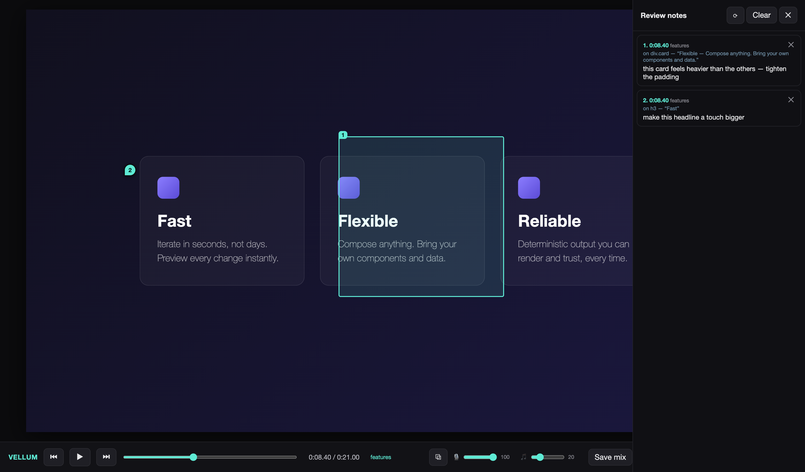

<div align="center">

# Vellum

### A transparent review-and-annotate layer for [HyperFrames](https://hyperframes.heygen.com) videos.

**Pin time-coded notes onto any frame of your composition — then your coding agent reads them back and makes the edits.**



<sub>Scrub the real composition · pin point or region notes on any frame · balance the audio mix live · hand the notes to your agent.</sub>

</div>

---

## Why

Reviewing a generated video is a visual, time-based act — *"this caption lands late," "make this bubble bigger," "cut two seconds here."* That feedback is hard to type into a chat box and even harder for an agent to act on, because it has no idea **where** or **when** you meant.

Vellum closes that loop. It lays a transparent layer over your *real* HyperFrames composition (not a render — the live thing, driven by the HyperFrames runtime). You scrub, click a spot or drag a box, and type the note. Vellum captures the exact **composition time**, the **on-screen element** you pointed at (tag, class, text), and the **pin/box coordinates**, then writes it all to a file your coding agent can read.

```
   You (human)                    Vellum                      Your agent
 ───────────────            ─────────────────           ──────────────────────
  scrub + pin a    ──────▶   notes/annotations.md  ──────▶  reads the notes,
  note on a frame            notes/annotations.json         edits index.html,
                             notes/mix.json                 verifies the fix
```

## How it lays on top of HyperFrames

Vellum never touches your composition. It loads your real `index.html` in an **iframe**, injects the HyperFrames runtime exactly as Studio and the renderer do, and floats an invisible pin layer over the top:

```
        ┌───────────────────────────────────────┐
        │   PIN LAYER  (transparent overlay)     │  ← Vellum
        │     • click = drop a pin 📍            │
        │     • drag  = draw a region ▢          │
        │   ┌───────────────────────────────┐   │
        │   │  your real index.html, running │   │  ← unmodified HyperFrames
        │   │  in an iframe via the runtime  │   │     (its own scripts, timeline,
        │   │  + GSAP timeline               │   │      audio — exactly as authored)
        │   └───────────────────────────────┘   │
        └───────────────────────────────────────┘
```

Because it mounts your actual composition, notes always line up with what's on screen — and it works for **any** HyperFrames project with no per-project configuration. Scenes are read from the `data-start` attributes every composition already has.

## Install

Vellum is distributed as a [shadcn GitHub registry](https://ui.shadcn.com/docs/registry/github) — install it straight from this repo into your HyperFrames project:

```bash
# the tool (server + player + review-packet builder)
npx shadcn@latest add github:jakeat11labs/vellum/vellum

# the agent skill — teaches Claude Code / Cursor how to apply your notes
npx shadcn@latest add github:jakeat11labs/vellum/vellum-skill
```

Or run it with zero install via npm:

```bash
npx vellum-hf        # from your HyperFrames project root
```

> **Requirements:** a HyperFrames project (an `index.html` composition and `node_modules/hyperframes` installed). Node ≥ 18. `ffmpeg` and the `hyperframes` CLI are only needed for the optional visual review packet.

### Try the included demo

This repo ships a tiny self-contained composition at [`examples/demo/`](examples/demo/) — the one pictured above. With the HyperFrames runtime available (`node_modules/hyperframes`), point Vellum at it:

```bash
VELLUM_DIR=examples/demo npx vellum-hf
```

## Use

From your HyperFrames project root:

```bash
npx vellum                      # composition is ./index.html
VELLUM_DIR=M01L01 npx vellum    # monorepo: composition is ./M01L01/index.html
```

Open the printed URL (`http://localhost:4848/…`). Then:

| Action | How |
|---|---|
| Play / pause | `Space` or ▶ |
| Scrub frame-by-frame | `←` / `→` (hold `Shift` for 1s steps) |
| Jump between scenes | `↑` / `↓` |
| **Add a note** | click **＋ Add note**, then click a spot (pin) or drag a box (region), and type |
| Balance the mix | drag the 🎙 voice / 🎵 music sliders, then **Save mix** |
| Review your notes | open the **Notes** drawer; click any note to jump to its frame |

Everything you pin is written to:

```
<composition>/notes/
├── annotations.md      # human-readable cue sheet (times, scenes, targets, text)
├── annotations.json    # structured notes for tooling
└── mix.json            # saved voice/music levels (if you hit "Save mix")
```

## Hand it to your agent

Once you've left notes, tell your coding agent:

> *"Address my Vellum review notes."*

With the `vellum-skill` installed, the agent will read `notes/annotations.md`, optionally render a **visual review packet** (each note's frame with the marker drawn on it)…

```bash
npx vellum-review        # → notes/review/note-<id>.png + INDEX.md
```

…and then edit the composition to satisfy each note, using the `hyperframes` / `hyperframes-cli` skills for the actual edit and verification. Vellum is the *what-and-where*; those skills are the *how*.

## Where Vellum sits in the toolchain

| Skill / tool | Owns |
|---|---|
| `hyperframes` | building & editing the composition |
| `hyperframes-cli` | `lint`, `preview`, `snapshot`, `render` |
| **`vellum`** | receiving human review feedback and turning it into edits |

Vellum is a **companion**, not a replacement — it defers to the HyperFrames skills for everything that changes the video.

## How it works (for the curious)

- **Zero runtime dependencies** — the server is pure Node built-ins; the player pulls only the HyperFrames runtime your project already has.
- **Local-only by design** — binds to `127.0.0.1`, sends no CORS headers, and guards against path traversal. The notes API can't be reached from another origin.
- **Faithful playback** — supports HTTP Range requests so audio/video seek correctly, and re-asserts each audio clip's state every frame so scrubbing into the middle of a clip still plays (the preview runtime only starts a clip when playback *crosses* its start).
- **Scene-aware markers** — a pin only appears while its own scene is on screen, so markers don't float across the whole timeline.

## License

MIT © Jake Rains
