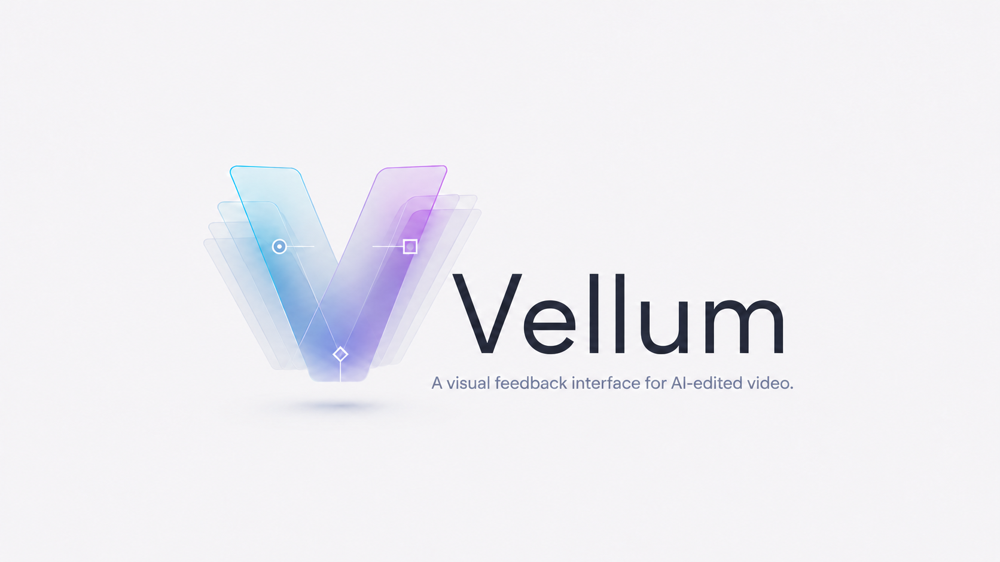
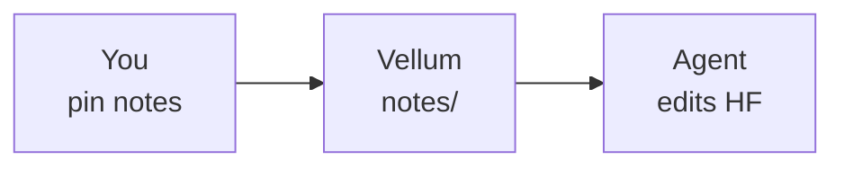

<div align="center">

<picture>
  <source media="(prefers-color-scheme: dark)" srcset="assets/logo-darkmode.png">
  
</picture>

### You see the problem. Your agent can't.

**Vellum is a visual feedback interface for AI-edited video —
pin time-coded notes onto any [HyperFrames](https://hyperframes.heygen.com) frame, and your coding agent reads them back and makes the edits.**

[](LICENSE)
[](package.json)
[](https://github.com/jakeat11labs/vellum/actions/workflows/test.yml)
[](https://hyperframes.heygen.com)

<br>

**[Install](#install)** · **[Use](#use)** · **[Agent handoff](#agent-handoff)** · **[Demo](#try-the-demo)**

<br>


<sub>Scrub the real composition · pin point or region notes · balance the mix · hand off to your agent</sub>

<br><br>

```bash
curl -fsSL https://tryvellum.vercel.app/install | sh
vellum
```

<sub>Pin your notes, then tell your agent: <i>“Address my Vellum review notes.”</i></sub>

</div>

---

## How it works

You watch the video and spot it instantly — *"this caption lands late," "make this bubble bigger," "cut two seconds here."* Typed into a chat box, that feedback loses **where** on the frame and **when** in the timeline.

Vellum closes the loop. It layers over your *real* `index.html` (HyperFrames runtime, not a render). You scrub, pin, type. Vellum records composition time, the element under your cursor, and pin/box coordinates — then writes files your agent reads.

| Step | What happens |
| --- | --- |
| **1 · Review** | Open the player, scrub to the moment, drop a pin or region note |
| **2 · Persist** | Notes land in `notes/annotations.md` (+ JSON, optional mix levels) |
| **3 · Hand off** | Your coding agent reads the notes and edits the composition |



Works on **any** HyperFrames project — scenes come from the `data-start` attributes every composition already has. No per-project configuration.

## Install

From the root of your HyperFrames project:

```bash
curl -fsSL https://tryvellum.vercel.app/install | sh
vellum
```

The installer drops the review tool into `scripts/`, adds a global `vellum` command to `~/.local/bin`, wires npm scripts when you have a `package.json`, and installs the agent skill to `.agents/skills/vellum/`. Pick Claude Code during install and `.claude/skills/vellum/` becomes a **symlink** to the same skill — one copy, both agents stay in sync.

Composition in a subfolder? Pass `--dir` during install:

```bash
curl -fsSL https://tryvellum.vercel.app/install | sh -s -- --dir compositions/hero
```

> **Requirements:** a HyperFrames project (an `index.html` composition) and Node ≥ 18. The HyperFrames runtime is resolved automatically — from a local `node_modules/hyperframes` if present, otherwise the npx cache or the CDN — so `npx`-style projects work without a local install. `ffmpeg` and the `hyperframes` CLI are only needed for the optional visual review packet.

<details>
<summary>Installer flags &amp; other install paths</summary>

**Flags:** `--dir <path>` · `--port <number>` · `--start` · `--tool-only` · `--skill-only` · `--no-bin` · `--no-prompt` · `--no-package`

Pin a release:

```bash
VELLUM_REF=v0.2.0 curl -fsSL https://raw.githubusercontent.com/jakeat11labs/vellum/main/install.sh | sh
```

**Clone & run**

```bash
git clone https://github.com/jakeat11labs/vellum.git
node /path/to/vellum/scripts/vellum-server.mjs   # from your HF project root
```

Or copy `scripts/` (+ `skills/vellum/` for the agent). Prefer a package? `vellum` and `vellum-review` bins ship in `package.json`.

**shadcn registry** (projects already using [shadcn/ui](https://ui.shadcn.com/docs/registry/github)):

```bash
npx shadcn@latest add jakeat11labs/vellum/vellum
npx shadcn@latest add jakeat11labs/vellum/vellum-skill
```

Registry install copies files only — add npm scripts yourself, or run `node scripts/vellum-server.mjs` directly. On plain HTML projects without shadcn, the curl installer is simpler.

See [`install.sh`](install.sh) for the full script.

</details>

## Use

From your HyperFrames project (any subfolder, after install):

```bash
vellum          # opens the review player in your browser
vellum-review   # optional visual packet for your agent
```

Subfolder compositions: the installer writes `.vellum.env` with your default `VELLUM_DIR`. Override anytime — `VELLUM_DIR=compositions/hero vellum`.

Skipped the global command (`--no-bin`)? Use `npm run vellum` or `./scripts/vellum`. Disable auto-open with `--no-open` or `VELLUM_OPEN=0`.

<details>
<summary>Keyboard shortcuts &amp; player controls</summary>

| Action | How |
| --- | --- |
| Play / pause | `Space` or ▶ |
| Scrub in 0.1s steps | `←` / `→` (hold `Shift` for 1s) |
| Jump between scenes | `↑` / `↓` |
| **Add a note** | `N` or **＋ Add note** → click (pin) or drag (region) → type |
| Balance the mix | 🎙 / 🎵 sliders → **Save mix** |
| Review notes | **Notes** drawer → click to jump; edit inline or cycle status |
| Hand off | **Copy prompt** → paste into your coding agent |

</details>

## Agent handoff

Every pin becomes a line in `notes/annotations.md` — time, scene, coordinates, target element, and your feedback:

```markdown
# Review notes

3 note(s). Times are composition-time (M:SS.ss).

- **note-1** · **0:02.40** `title` — Hold this a beat longer before the crossfade  _(pin 50.0%, 41.2%)_ · on `div.title` “Build it once. Ship everywhere.”
- **note-2** · **0:08.10** `features` — “Reliable” lands late — bring this card in 0.5s earlier  _(pin 74.6%, 52.3%)_ · on `div.card` “Reliable”
- **note-3** · **0:13.90** `stat` — make this number count up instead of fading in  _(box 24.1 × 30.0%)_ · on `div.stat` “10×”
```

Also written: `annotations.json` (structured) and `mix.json` (if you saved mix levels).

When you're done reviewing:

> *"Address my Vellum review notes."*

The agent then:

1. **Reads** `notes/annotations.md` — each `note-<id>` links time, scene, and DOM target.
2. **Sees what you saw** (optional) — `vellum-review` renders each frame with pins drawn on: `notes/review/note-<id>.png` + `INDEX.md`.
3. **Edits** the composition, snapshots to verify, and reports back note by note.

| Skill / tool | Owns |
| --- | --- |
| `hyperframes` | building & editing the composition |
| `hyperframes-cli` | `lint` · `preview` · `snapshot` · `render` |
| **`vellum`** | turning human review notes into those edits |

## Try the demo

Self-contained composition (screenshot above):

```bash
git clone https://github.com/jakeat11labs/vellum.git && cd vellum
npm i && VELLUM_DIR=examples/demo vellum
```

<details>
<summary>Under the hood</summary>

Vellum never modifies your composition. It loads your real `index.html` in an **iframe**, injects the HyperFrames runtime, and floats a pin layer on top:

```
        ┌───────────────────────────────────────┐
        │   PIN LAYER  (transparent overlay)     │  ← Vellum
        │     • click = pin   • drag = region    │
        │   ┌───────────────────────────────┐   │
        │   │  your index.html + HF runtime  │   │  ← unmodified
        │   └───────────────────────────────┘   │
        └───────────────────────────────────────┘
```

- **Zero server dependencies** — pure Node built-ins; the player uses your project's HyperFrames runtime.
- **Local-only** — binds `127.0.0.1`, no CORS, path-traversal guards on the notes API.
- **Faithful playback** — HTTP Range requests for media seek; audio state re-asserted every frame.
- **Scene-aware markers** — pins only show while their scene is on screen.

**Review packet caveat:** `vellum-review` uses `hyperframes snapshot`, which drives the GSAP timeline but does not toggle `data-start` clip visibility. Compositions that change scenes *only* via clip toggling (not timeline opacity) may show stacked scenes in packet frames. Timeline-driven transitions — like [`examples/demo`](examples/demo/) — render correctly.

</details>

<div align="center">

<br>


<br>

MIT © Jake Rains

</div>